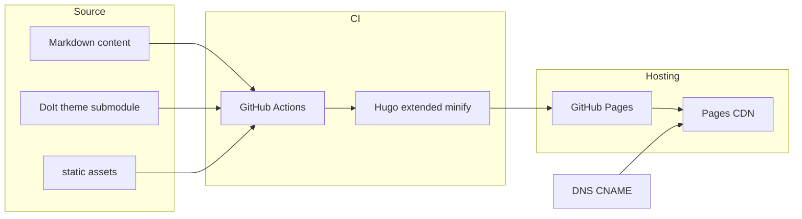

# Solution overview

This folder describes **how** the Highland Hideaway site is implemented and operated, traceable to [`../01-requirements/`](../01-requirements/).

## Architecture (high level)

1. Editors commit to **`highlandhideaway.ca`** on **`main`**.
2. **GitHub Actions** checks out the repo **with submodules**, runs **`hugo --minify`**, uploads **`public/`** as a Pages artifact.
3. **GitHub Pages** serves the static site; **DNS** (e.g. `www.highlandhideaway.ca`) points at Pages.

**Quick links:** [00-index.md](00-index.md) lists every doc in this section plus [adr/](adr/).

| Document | Purpose |
|----------|---------|
| [tech-stack.md](tech-stack.md) | Hugo, theme, key configuration |
| [content-model.md](content-model.md) | Content layout and taxonomies |
| [build-and-deploy.md](build-and-deploy.md) | Local and CI build |
| [domain-and-analytics.md](domain-and-analytics.md) | URLs, CNAME, GA |
| [operations.md](operations.md) | Day-to-day maintenance |
| [adr/](adr/) | Architecture decision records |
