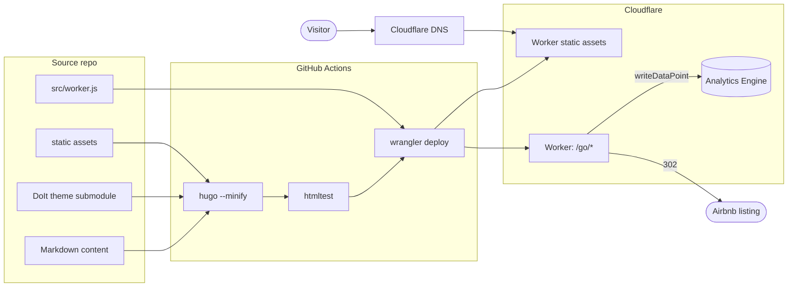

# Solution overview

This folder describes how the Highland Hideaway site is implemented and operated, traceable to [`../01-requirements/`](../01-requirements/).

## Architecture

```mermaid
flowchart LR
  subgraph source [Source repo]
    MD[Markdown content]
    Theme[DoIt theme submodule]
    Static[static assets]
    Worker[src/worker.js]
  end
  subgraph ci [GitHub Actions]
    Build[hugo --minify]
    Test[htmltest]
    Deploy[wrangler deploy]
  end
  subgraph cf [Cloudflare]
    Assets[Worker static assets]
    WK[Worker: /go/*]
    AE[(Analytics Engine)]
  end
  MD --> Build
  Theme --> Build
  Static --> Build
  Build --> Test
  Test --> Deploy
  Worker --> Deploy
  Deploy --> Assets
  Deploy --> WK
  WK -- writeDataPoint --> AE
  DNS[Cloudflare DNS] --> Assets
  Visitor([Visitor]) --> DNS
  WK -- 302 --> Airbnb([Airbnb listing])
```

1. Editors commit to `highlandhideaway.ca` on `main`.
2. GitHub Actions checks out with submodules, runs `hugo --minify`, then runs `htmltest` against `public/`.
3. The deploy job `needs:` the build job, so a failing link check stops the release. See [ADR-0004](adr/0004-deploy-from-github-actions.md).
4. `wrangler deploy` ships `public/` as Worker static assets, plus `src/worker.js`.
5. Cloudflare serves everything from the asset store without running code. The Worker runs only for `/go/*`, where it counts a booking click and redirects to the listing.

The apex `highlandhideaway.ca` is canonical. See [ADR-0005](adr/0005-make-the-apex-canonical.md).

**Quick links:** [00-index.md](00-index.md) lists every doc in this section plus [adr/](adr/).

| Document | Purpose |
|----------|---------|
| [tech-stack.md](tech-stack.md) | Hugo, theme, Worker, pinned versions |
| [content-model.md](content-model.md) | Content layout and taxonomies |
| [build-and-deploy.md](build-and-deploy.md) | Local build, CI, deploy gate, secrets |
| [domain-and-analytics.md](domain-and-analytics.md) | URLs, canonical host, SEO surface, analytics |
| [operations.md](operations.md) | Monitoring, runbook, day-to-day maintenance |
| [adr/](adr/) | Architecture decision records |
